## Correlation of World GDP and Human Development Indexes
#### With a twist of Corruption index analysis…

Group:
- Adriana Avalos
- Levi Rodríguez
- Luis Goldaracena
- Matheus Gratz

---

Nowadays there is a lot of data about global economic growth by nations and the wellbeing of their habitants. 

Therefore, a natural question is how do economic growth impact on wellbeing. 

In cases where no correlation can be obtained between these two factors, we can look for other indexes (such as Corruption Index) that might help us to understand this kind of behavior.

#### Does economic growth impact on wellbeing?
---
List of contents (click to go to):

1. [High Level Process](#process)
2. [World Bank Database](#worldbank)
3. [Human Development Database](#hdev)
4. [World Corruption Index](#corruption)
5. [Results and Findings](#results)

---

### High Level Process 
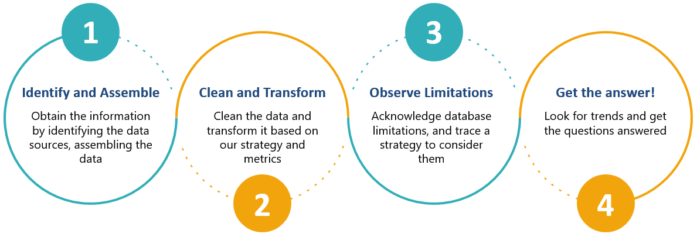

---

### World Bank 

The World Bank website have 78 indicators for 264 nations around the world. Those indicators can be as simple as GDP – Gross Domestic Product, or complex such as Health nutrition and Population Statistics.

The website has a tool which you can design you own report and export to CSV and other formats.
In our case, we designed a report to extract the historical GDP from all available nations, from 1990 to 2017, and exported it to a CSV file.

---

### Human Development 

The United Nations development Programme for Human Development Reports has thousand of indicators. 
Examples:
HDI: Human development index (HDIg)
Internet users (% of population)
GII: Gender Inequality Index
Mobile phone subscriptions (per 100 people)

In our case, set an API request to extract almost 1million records from the HDEV website, and transform them directly in python using pandas!

---

### Corruption 
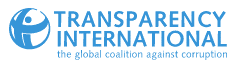

The CPI scores and ranks countries/territories based on how corrupt a country’s public sector is perceived to be by experts and business executives. 

It is a composite index, a combination of 13 surveys and assessments of corruption, collected by a variety of reputable institutions.

In our case, the Transparency website has the database already in CSV, we loaded it in python using pandas!

---

### Results 

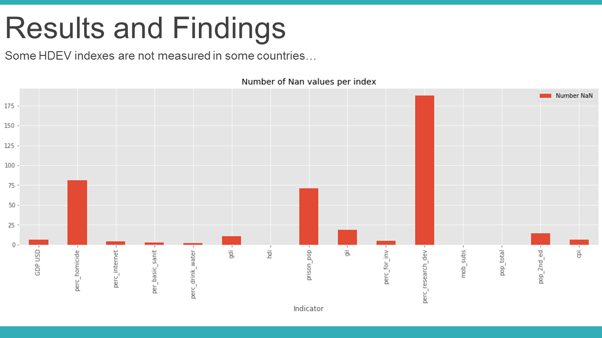
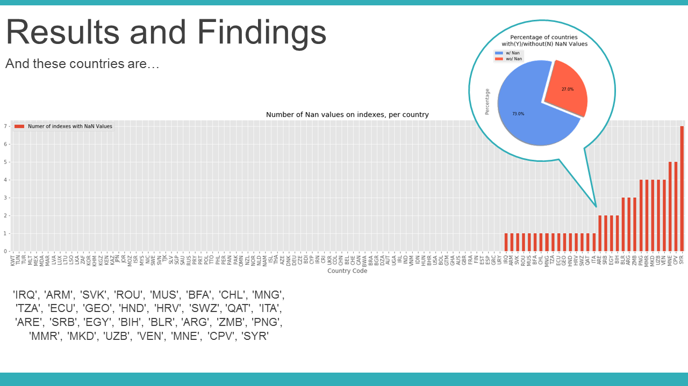
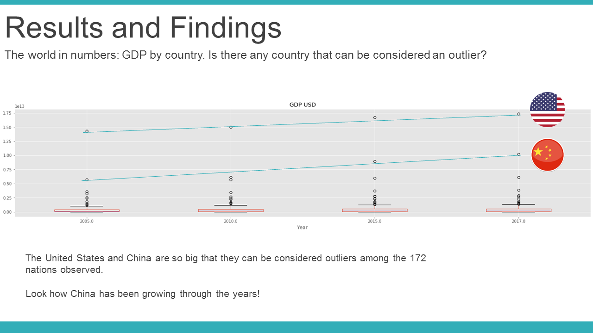
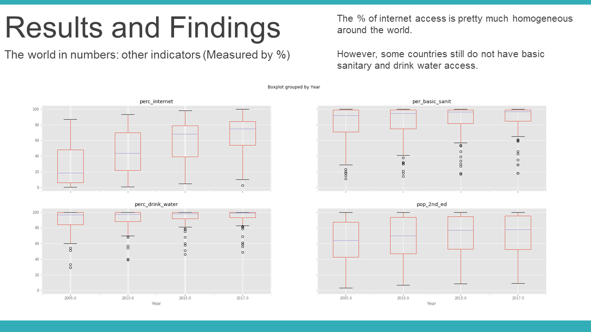
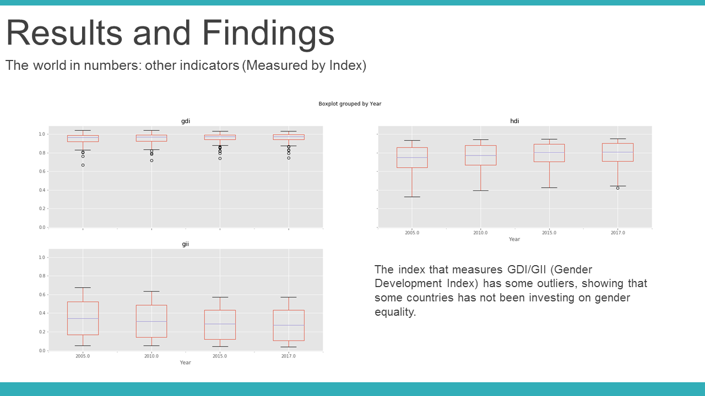
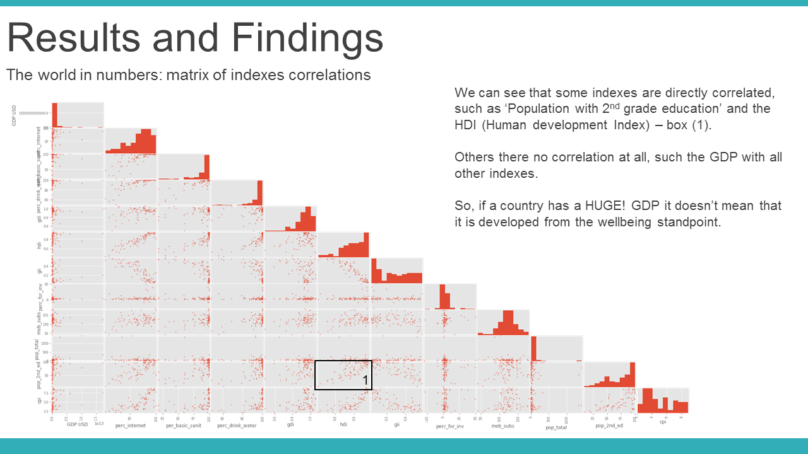
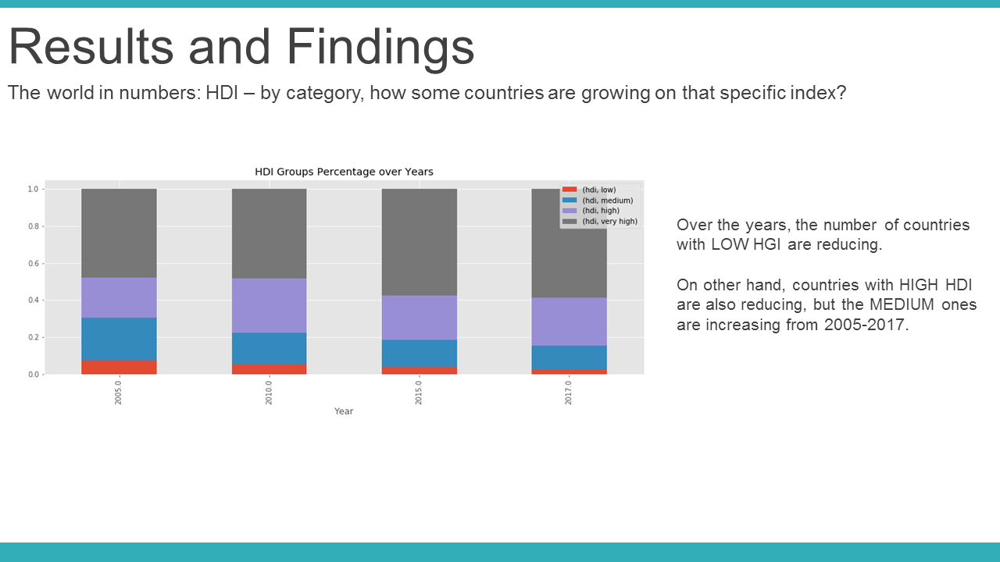
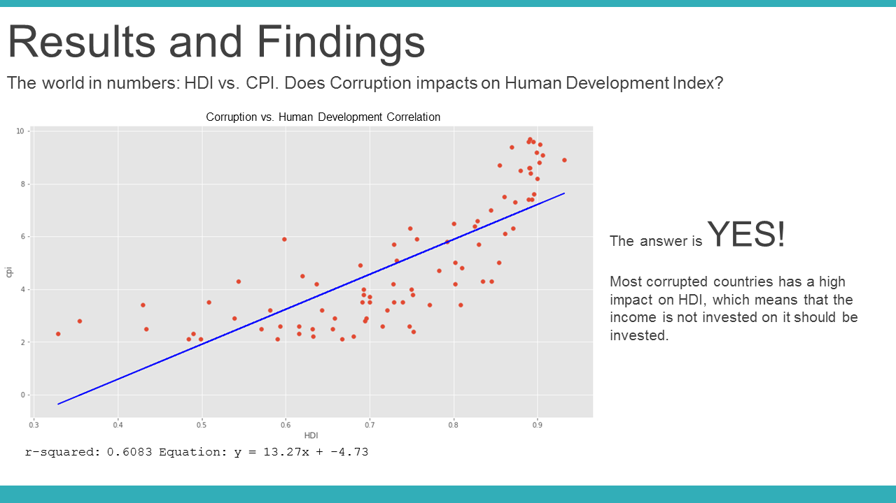
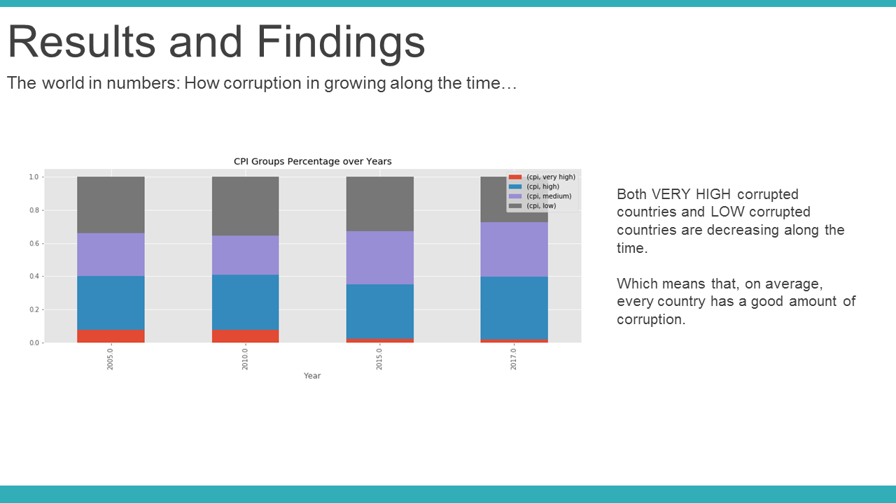

---
# Thank you!
